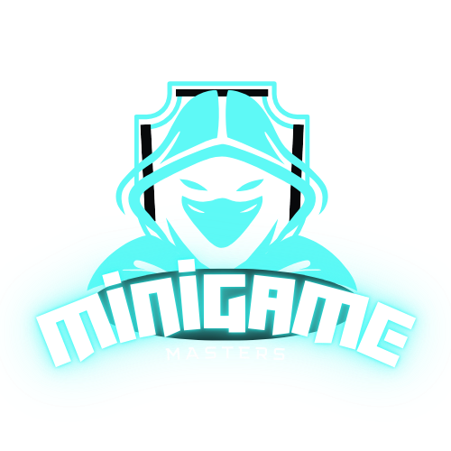

# Minigame-Masters

 

## Description

With minigame masters, you will create a profile with a username, email, and password. You can then pick a game from a selection of both single player games and multiplayer games. When playing multiplayer games, you can create a room and by providing that room name to someone else, you can play with anybody. You earn coins as you play and you can see the leaderboards, where you can see who has the most coins. We simply wanted to create a site where users can have fun playing simple games!!

## Table of Contents

- [Features](#Features)
- [Installation](#Installation)
- [Usage](#Usage)
- [Screenshots] (#Screenshots)
- [Prerequisites] (#Prerequisites)
- [Contact](#contact)

## Features

- **Feature 1**: Navigation bar wtih Home page, Multiplayer, Single Player, Leaderboards, Sign up, Profile and Login.
- **Feature 2**: Create a Profile on sign up page with a username, email, and password.
- **Feature 3**: Multiplayer page gives you selection of multiplayer games. You can create game rooms and give that name to a friend so they can join the game and play with you.
- **Feature 4**: Single Player page give you a selection of single player games
- **Feature 5**: Earn coins by playing games.
- **Feature 6**: Leaderboards show you your rank in relation to other users based on number of coins you have.
- **Feature 7**: On your profile page, see all your login information plus all of your coins you have earned from playing games.

## Installation
-npm run develop
-npm i

## Usage
To use minigame-masters, go to this link: https://minigame-masters.onrender.com/

## Screenshots

## Prerequisites

- Node.js >= 14.x
- MongoDB >= 4.2
- Apollo Server
- Mongoose
- Socket.io
- GraphQL
- Express
- Dotenv
- bcrypt
- React
- React DOM

## Contact

- Noah Manno
  Email: noahmanno19@gmail.com
  Github: Noah-Manno

- Michael Daleo
  Email: mikejdaleo@gmail.com
  Github: mikedaleo

- Christopher Josephs
  Email: codecj93@gmail.com
  Github: codecj93

- Christopher Giordano
  Email: chrisgcpg@gmail.com
  Github: Milkytea6

- Phil Choi
  Email: choi.phil87@gmail.com
  Github: pchoi87

